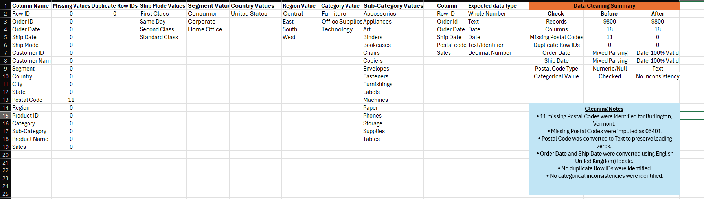
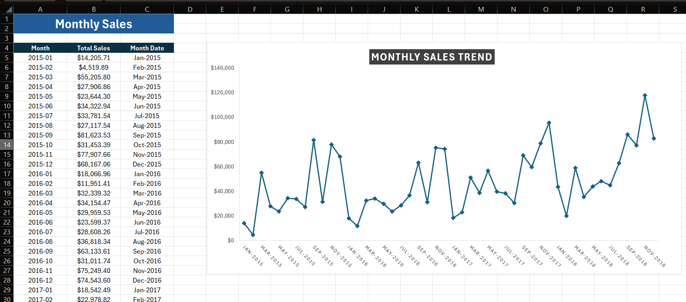
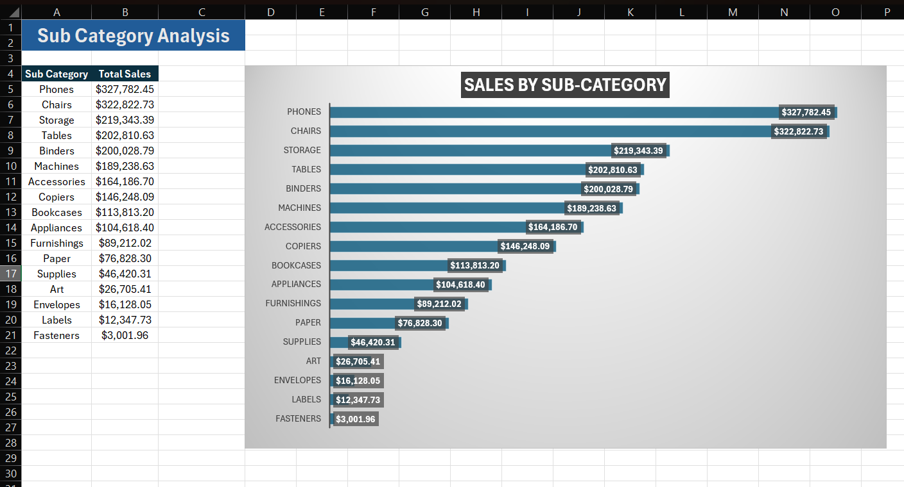
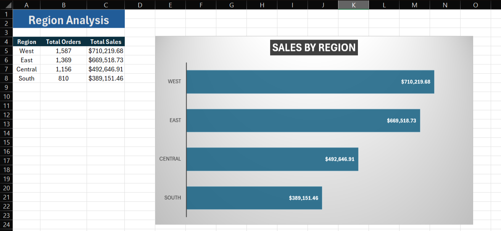
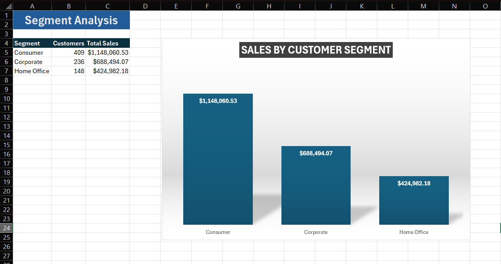
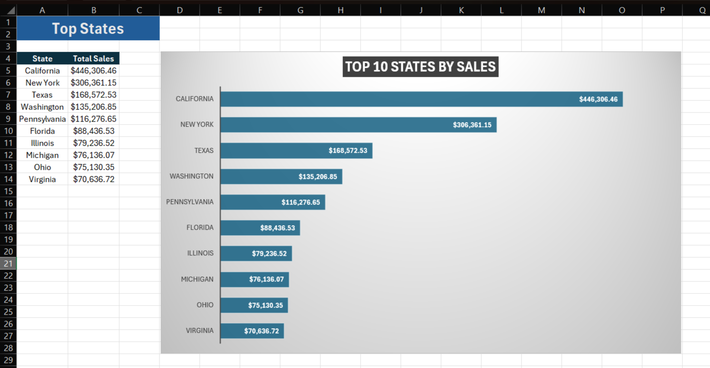
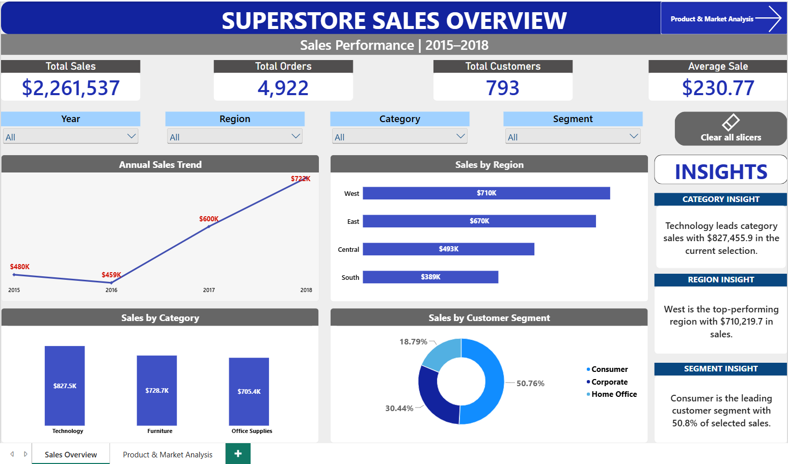
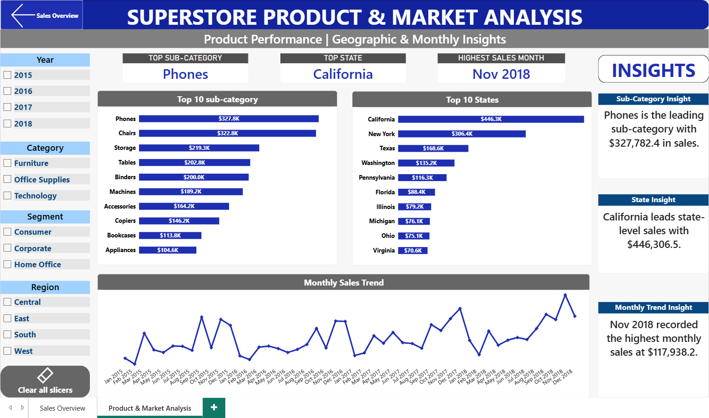

# 📊 Superstore Sales Analytics

## End-to-End Data Analytics Case Study | SWYNEX Technologies

> **Final Data Analytics Project – Task 4**  
> Data Cleaning → SQL Analysis → Business Insights → Power BI Dashboard

---

## 📌 Project Overview

This project was completed as **Task 4 – Final Data Analytics Project** of my Data Analytics Internship with **SWYNEX Technologies**.

The project combines the work completed throughout Tasks 1–3 into a complete **end-to-end data analytics case study**.

The objective was to transform a raw Superstore sales dataset into a clean, analysis-ready dataset, perform exploratory analysis, identify meaningful business insights, and develop an interactive Power BI dashboard for decision-making.

### 🔄 End-to-End Workflow

**Raw Data → Data Cleaning → Data Validation → Exploratory Data Analysis → Business Insights → Interactive Dashboard → Business Recommendations**

---

## 🎯 Problem Statement

Superstore management needs a clearer understanding of historical sales performance across **products, customer segments, geographical markets, and time**.

Although transactional sales data is available, the raw data first needs to be cleaned, validated, analyzed, and transformed into meaningful information.

The goal of this project is to create an analytics solution that helps stakeholders:

- Monitor overall sales performance
- Understand sales trends over time
- Identify high-performing products
- Compare geographical markets
- Understand customer segment contributions
- Identify strong sales periods
- Investigate unusually high-value transactions
- Explore results using an interactive dashboard

---

## ❓ Business Questions

The project was designed to answer the following questions:

1. How has sales performance changed over time?
2. Which product categories generate the highest sales?
3. Which sub-categories contribute the most sales?
4. Which regions and states generate the highest sales?
5. Which customer segment contributes the largest share of sales?
6. Which months demonstrate the strongest sales activity?
7. Which individual products generate the highest sales?
8. Are there unusually high-value transactions?
9. How can these findings be communicated through an interactive dashboard?

---

## 📂 Dataset

**Dataset:** Superstore Sales Forecasting  
**Source:** Kaggle  
**Dataset Link:** [Superstore Sales Forecasting](https://www.kaggle.com/datasets/rohitsahoo/sales-forecasting)

### Dataset Overview

- **Records:** 9,800
- **Columns:** 18
- **Unique Orders:** 4,922
- **Unique Customers:** 793
- **Analysis Period:** 2015–2018
- **Total Sales:** $2,261,536.78

The dataset contains information relating to:

- Orders
- Shipping
- Customers
- Customer segments
- Geography
- Product categories
- Product sub-categories
- Products
- Sales

---

## 🛠️ Tools & Technologies

| Stage | Technology |
|---|---|
| Data Cleaning | Microsoft Excel |
| Data Transformation | Power Query |
| Database | MySQL |
| SQL Development | MySQL Workbench |
| Exploratory Analysis | MySQL + Excel |
| Dashboard | Microsoft Power BI |
| Calculations | DAX |
| Documentation | GitHub |

---

# 🧹 Phase 1 – Data Cleaning & Preparation

The raw dataset was assessed for common data-quality problems.

### Checks Performed

- ✅ Missing values
- ✅ Duplicate records
- ✅ Incorrect data types
- ✅ Date parsing issues
- ✅ Categorical consistency
- ✅ Data completeness

### Missing Values

The assessment identified:

- **11 missing values** in `Postal Code`
- **0 missing values** across all other columns

The affected records were associated with **Burlington, Vermont**.

The missing Postal Code values were imputed as `05401`.

Postal Code was stored as **Text** to preserve leading zeros.

### Duplicate Check

`Row ID` was used as the record-level identifier.

- **Duplicate Row IDs:** 0
- **Records Removed:** 0

Repeated Order IDs were not considered duplicate records because one order can contain multiple products.

### Date Standardization

The source dates were initially interpreted inconsistently in Excel because of locale differences.

The affected fields were:

- `Order Date`
- `Ship Date`

Both fields were standardized using Power Query.

After transformation:

- **Order Date:** 100% Valid
- **Ship Date:** 100% Valid
- **Date Errors:** 0

### Categorical Consistency

The following categorical fields were reviewed:

- `Ship Mode`
- `Segment`
- `Country`
- `Region`
- `Category`
- `Sub-Category`

No obvious spelling or capitalization inconsistencies were identified.

### Cleaning Result

**Before Cleaning**

- Records: **9,800**
- Missing Postal Codes: **11**
- Duplicate Row IDs: **0**

**After Cleaning**

- Records: **9,800**
- Missing Postal Codes: **0**
- Duplicate Row IDs: **0**
- Records Removed: **0**

### 📸 Data Quality Report

> Additional cleaning screenshots are available in the `screenshots/cleaning/` folder.

---

# 🔍 Phase 2 – Exploratory Data Analysis

After cleaning, the analysis-ready dataset was imported into **MySQL**.

SQL was used to investigate:

- Overall summary statistics
- Dataset time range
- Annual sales trends
- Monthly sales trends
- Category performance
- Sub-category performance
- Regional performance
- State-level performance
- Customer segments
- Top products
- Sales distribution
- High-value transactions
- Potential statistical anomalies

---

## 📊 Overall Statistics

- **Total Records:** 9,800
- **Total Orders:** 4,922
- **Total Customers:** 793
- **Total Sales:** $2,261,536.78
- **Average Sale:** $230.77
- **Minimum Sale:** $0.44
- **Maximum Sale:** $22,638.48
- **Earliest Order:** 03-Jan-2015
- **Latest Order:** 30-Dec-2018
- **Days Covered:** 1,457

### 📸 EDA Summary

---

## 📈 Annual Sales Trend

Annual sales were:

- **2015:** $479,856.21
- **2016:** $459,436.01
- **2017:** $600,192.55
- **2018:** $722,052.02

Sales declined slightly in 2016 before recovering strongly during 2017 and 2018.

Overall sales increased by approximately **50.5% from 2015 to 2018**.

---

## 📅 Monthly Sales Trend

The five highest-sales months were:

1. **November 2018:** $117,938.16
2. **December 2017:** $95,739.12
3. **September 2018:** $86,152.89
4. **December 2018:** $83,030.39
5. **September 2015:** $81,623.53

November 2018 recorded the highest monthly sales.

---

## 📦 Category Performance

Category sales were:

- **Technology:** $827,455.87
- **Furniture:** $728,658.58
- **Office Supplies:** $705,422.33

Technology contributed approximately **36.6% of total sales**.

---

## 📦 Sub-Category Performance

The leading sub-categories were:

1. **Phones:** $327,782.45
2. **Chairs:** $322,822.73
3. **Storage:** $219,343.39
4. **Tables:** $202,810.63
5. **Binders:** $200,028.79

Phones and Chairs together contributed approximately **28.8% of total sales**.

Fasteners recorded the lowest sub-category sales at approximately **$3,001.96**.

---

## 🌎 Regional Performance

Regional sales were:

- **West:** $710,219.68
- **East:** $669,518.73
- **Central:** $492,646.91
- **South:** $389,151.46

West and East together accounted for approximately **61% of total sales**.

---

## 👥 Customer Segment Analysis

Customer segment sales were:

- **Consumer:** $1,148,060.53
- **Corporate:** $688,494.07
- **Home Office:** $424,982.18

Approximate contribution:

- **Consumer:** 50.8%
- **Corporate:** 30.4%
- **Home Office:** 18.8%

The Consumer segment represented slightly more than half of total sales.

---

## 🗺️ State Analysis

State-level sales were analyzed to identify the highest-performing states.

---

## 🛒 Top Products

Individual products were analyzed to identify those generating the highest sales.

---

# 🔎 Anomaly Analysis

The sales distribution was investigated to identify unusually high-value transactions.

### Distribution Statistics

- **Average Sale:** $230.77
- **Standard Deviation:** $626.62
- **Minimum Sale:** $0.44
- **Maximum Sale:** $22,638.48

Potential high-value anomalies were identified using:

> **Anomaly Threshold = Mean + (3 × Standard Deviation)**

The approximate threshold was:

**$2,110.63**

### Results

- **Potential High-Value Anomalies:** 123
- **Share of Records:** approximately 1.26%

These records are statistically unusual because of their high sales values, but they should not automatically be interpreted as data errors.

---

# 💡 Key Business Insights

### 1️⃣ Strong Long-Term Sales Growth

Sales increased from approximately **$479.9K in 2015** to **$722.1K in 2018**, representing approximately **50.5% growth**.

### 2️⃣ Technology Leads Category Sales

Technology generated approximately **$827.5K**, representing approximately **36.6% of total sales**.

### 3️⃣ Phones and Chairs Lead Sub-Category Sales

Phones generated approximately **$327.8K**, while Chairs generated approximately **$322.8K**.

Together they contributed approximately **28.8% of total sales**.

### 4️⃣ West and East Dominate Regional Sales

West generated approximately **$710.2K**, followed by East at approximately **$669.5K**.

Together they accounted for approximately **61% of total sales**.

### 5️⃣ Consumers Generate More Than Half of Sales

The Consumer segment generated approximately **$1.148M**, representing approximately **50.8% of overall sales**.

### 6️⃣ Late-Year Months Show Strong Sales Activity

November 2018 generated approximately **$117.9K**, making it the strongest month in the dataset.

Several of the highest-performing months occurred later in the year.

### 7️⃣ High-Value Transactions Are Relatively Uncommon

Approximately **1.26% of records** exceeded the statistical high-value threshold.

These transactions may represent particularly valuable orders that warrant further investigation.

---

# 📊 Phase 3 – Interactive Power BI Dashboard

The analytical findings were transformed into a **two-page interactive Power BI dashboard**.

### Interactive Features

- ✅ Dynamic KPI cards
- ✅ Interactive slicers
- ✅ Cross-filtering
- ✅ DAX measures
- ✅ Dynamic insight cards
- ✅ Page navigation
- ✅ Clear filter buttons
- ✅ Top N analysis
- ✅ Date-based analysis

---

## 📈 Dashboard Page 1 – Sales Overview

### KPIs

- Total Sales
- Total Orders
- Total Customers
- Average Sale

### Filters

- Year
- Region
- Category
- Segment

### Visualizations

- Annual Sales Trend
- Sales by Region
- Sales by Category
- Sales by Customer Segment

### Dynamic Insights

DAX-powered insight cards identify:

- Leading Category
- Leading Region
- Leading Customer Segment

### 📸 Sales Overview Dashboard

---

## 🌎 Dashboard Page 2 – Product & Market Analysis

### Dynamic KPIs

- Top Sub-Category
- Top State
- Highest Sales Month

### Filters

- Year
- Region
- Category
- Segment

### Visualizations

- Top 10 Sub-Categories by Sales
- Top 10 States by Sales
- Monthly Sales Trend

### Dynamic Insights

DAX-powered insight cards dynamically identify:

- Leading Sub-Category
- Leading State
- Highest-Sales Month

### 📸 Product & Market Analysis Dashboard

---

# 🧮 Power BI Data Model

A dedicated `DateTable` was created for time-based analysis.

### Relationship

`DateTable[Date]` → `Sales[Order Date]`

### Configuration

- **Cardinality:** One-to-Many (`1:*`)
- **DateTable:** One side
- **Sales:** Many side
- **Cross-filter direction:** Single
- **Relationship:** Active

---

# ⚡ DAX Measures

### Total Sales

~~~DAX
Total Sales =
SUM(Sales[Sales])
~~~

### Total Orders

~~~DAX
Total Orders =
DISTINCTCOUNT(Sales[Order ID])
~~~

### Total Customers

~~~DAX
Total Customers =
DISTINCTCOUNT(Sales[Customer ID])
~~~

### Average Sale

~~~DAX
Average Sale =
AVERAGE(Sales[Sales])
~~~

### Additional Dynamic Measures

Additional measures were developed for:

- `Top Sub-Category`
- `Top State`
- `Highest Sales Month`
- `Category Insight`
- `Region Insight`
- `Segment Insight`
- `Sub-Category Insight`
- `State Insight`
- `Monthly Trend Insight`

These measures allow the dashboard to respond dynamically to user selections.

---

# 💼 Business Recommendations

### 1️⃣ Protect High-Performing Product Groups

Technology is the strongest category, while Phones are the strongest sub-category.

Maintaining product availability and monitoring demand for these groups could help protect a significant share of sales.

### 2️⃣ Explore Cross-Selling Opportunities

Phones and Chairs collectively contribute a substantial share of total sales.

Related products and accessories could be investigated for potential cross-selling opportunities.

### 3️⃣ Investigate Lower-Performing Regions

West and East dominate overall sales.

Central and South should be investigated to understand whether differences in customer demand, product mix, or market activity explain their lower contribution.

### 4️⃣ Prioritize Consumer Retention

Consumers account for approximately **50.8% of overall sales**.

Retention and targeted marketing focused on this segment could help protect the largest customer base.

### 5️⃣ Prepare for Strong Late-Year Demand

Several high-performing months occurred later in the year.

Inventory, marketing, and operational planning could be strengthened ahead of historically strong periods.

### 6️⃣ Investigate High-Value Transactions

The 123 potential high-value anomalies may represent valuable large orders rather than errors.

Further analysis could identify:

- High-value customers
- Large purchasing patterns
- High-performing products
- Potential enterprise customers

---

# 📁 Repository Structure

~~~text
SWYNEX-Final-Data-Analytics-Project/
│
├── data/
│   ├── raw/
│   │   └── train.csv
│   └── cleaned/
│       └── superstore_cleaned.csv
│
├── data-cleaning/
│   └── superstore_working.xlsx
│
├── sql/
│   ├── 01_database_setup.sql
│   ├── 02_data_validation.sql
│   └── 03_exploratory_analysis.sql
│
├── analysis/
│   └── superstore_eda.xlsx
│
├── dashboard/
│   └── superstore_interactive_dashboard.pbix
│
├── screenshots/
│   ├── cleaning/
│   │   ├── 01_raw_data.png
│   │   ├── 02_data_quality_report.png
│   │   └── 03_cleaned_data.png
│   ├── eda/
│   │   ├── 01_eda_summary.png
│   │   ├── 02_annual_sales_trend.png
│   │   ├── 03_monthly_sales.png
│   │   ├── 04_category_analysis.png
│   │   ├── 05_subcategory_analysis.png
│   │   ├── 06_region_analysis.png
│   │   ├── 07_segment_analysis.png
│   │   ├── 08_top_states.png
│   │   ├── 09_top_products.png
│   │   └── 10_anomaly_analysis.png
│   └── dashboard/
│       ├── 01_sales_overview.png
│       └── 02_product_market_analysis.png
│
└── README.md
~~~

---

# 🔗 Project Progression

This final case study combines all previous SWYNEX internship tasks.

## Task 1 – Data Cleaning & Preparation

**Tools:** Excel + Power Query

🔗 [View Task 1 Repository](PASTE-TASK-1-GITHUB-URL-HERE)

---

## Task 2 – Exploratory Data Analysis

**Tools:** MySQL + Excel

🔗 [View Task 2 Repository](PASTE-TASK-2-GITHUB-URL-HERE)

---

## Task 3 – Interactive Dashboard

**Tools:** Power BI + DAX

🔗 [View Task 3 Repository](PASTE-TASK-3-GITHUB-URL-HERE)

---

# 📚 Key Learnings

This project strengthened my understanding of the complete analytics lifecycle:

- ✅ Data Cleaning
- ✅ Data Validation
- ✅ Power Query
- ✅ SQL
- ✅ Exploratory Data Analysis
- ✅ Statistical Analysis
- ✅ Business Analysis
- ✅ Power BI
- ✅ DAX
- ✅ Data Modeling
- ✅ Interactive Dashboard Development
- ✅ Business Insight Communication
- ✅ Business Recommendations
- ✅ GitHub Documentation

---

# ✅ Conclusion

This project demonstrates a complete **end-to-end data analytics workflow** using:

**Excel → Power Query → MySQL → Excel EDA → Power BI → DAX**

Starting with raw transactional data, the project progressed through cleaning, validation, exploratory analysis, statistical investigation, business insight generation, and interactive dashboard development.

The final result is a documented analytics case study that provides detailed analytical findings alongside an interactive tool for exploring Superstore sales performance.

---

# 👤 Author

**Emmanuel Subek Das**

Data Analytics Intern  
**SWYNEX Technologies**

---

# 🔗 Dataset Source

**Superstore Sales Forecasting – Kaggle**

https://www.kaggle.com/datasets/rohitsahoo/sales-forecasting

---

### 🚀 SWYNEX Technologies Data Analytics Internship
### Task 4 – Final Data Analytics Project
